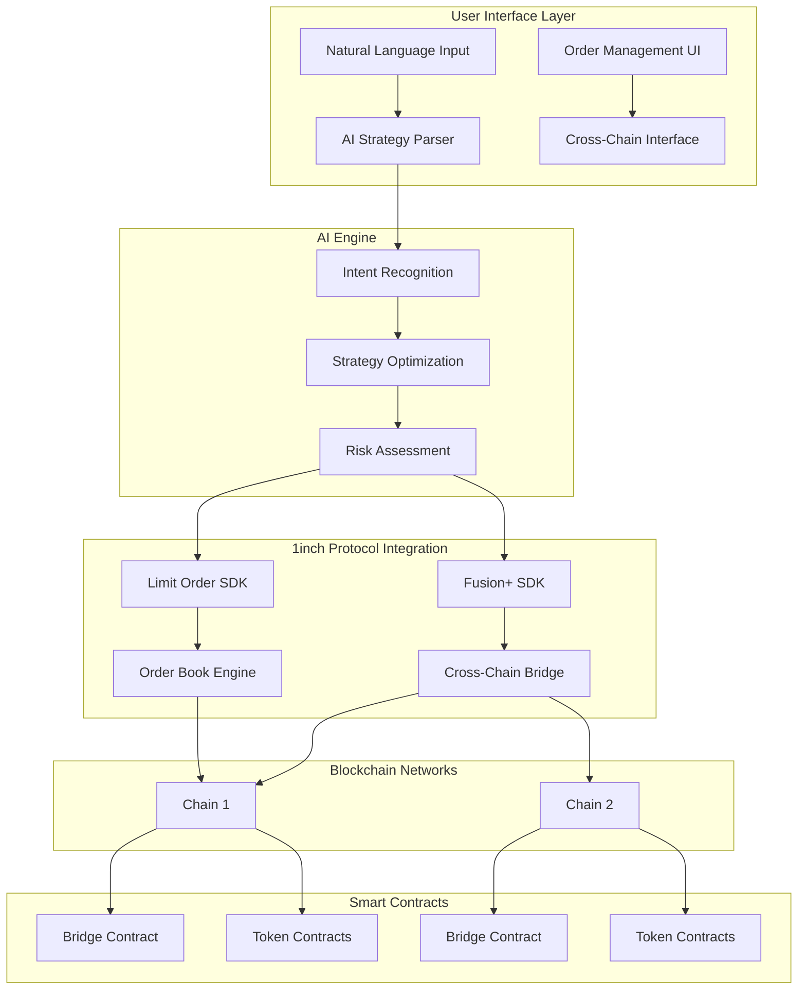

# 🧠 1inch AI-Driven Smart Vault

> **Natural Language DeFi Execution**: A non-custodial application where users articulate DeFi strategies in plain English, and intelligent AI agents translate them into precise, executable on-chain operations through 1inch's battle-tested protocols.


## 🎯 Project Vision

The **1inch AI-Driven Smart Vault** is a revolutionary non-custodial application that empowers users to articulate their DeFi investment or liquidity provisioning goals using natural language. At its core, an intelligent AI agent interprets these high-level objectives and translates them into a series of precise, executable on-chain strategies.

**Crucially, the "vault" itself is not a new smart contract** that users need to deploy or manage. Instead, it serves as a **conceptual framework** for securely managing user assets and executing strategies through **1inch's existing, battle-tested, and audited protocols** (Fusion+ and Limit Order Protocol).

This innovative approach delivers a **user experience akin to a centralized exchange (CEX)** – intuitive and streamlined – while preserving the fundamental benefits of decentralized finance: **non-custodial asset control** and **transparency**.

## 🤖 Core Innovation: Natural Language Strategy Execution

### How It Works
Users express their DeFi goals in **natural language**, and our AI agent interprets these objectives into **executable 1inch protocol operations**:

#### 🧠 AI Agent Capabilities
- **Natural Language Processing**: Converts user intentions into precise trading parameters
- **Strategy Translation**: Maps high-level goals to specific 1inch Fusion+ and Limit Order operations  
- **Risk Assessment**: Analyzes market conditions and suggests optimal execution timing
- **Gas Optimization**: Leverages 1inch's efficient routing for cost-effective transactions

#### 🎯 Currently Supported Strategies
**Live and functional through 1inch protocols:**

**ETH/WETH/USDC Trading:**
- ✅ **Stop Loss Orders**: "Sell my ETH if price drops below $3,500"
- ✅ **Take Profit Orders**: "Sell 50% of my WETH when it reaches $4,200" 
- ✅ **Buy Orders (Submit)**: "Buy 0.0003 WETH when price is below $4,000" → Immediate order submission
- ✅ **Buy Orders (Trigger)**: "Buy 0.0003 WETH when price goes above $4,000" → Conditional trigger order

#### 🛠️ Planned Strategies (Roadmap)
**Additional strategies to be implemented for ETH/WETH/USDC:**

**📊 Advanced Order Types:**
- 🔄 **Dollar Cost Averaging (DCA)**: "Buy $100 of ETH every week for the next 6 months"
- 📈 **Trailing Stop Loss**: "Sell my ETH if it drops 10% from its highest point"
- 🎯 **Target Allocation**: "Keep my portfolio at 60% ETH, 30% USDC, 10% WETH - rebalance when needed"
- ⚡ **Instant Arbitrage**: "Buy ETH on the cheapest DEX and sell on the most expensive automatically"

**📅 Time-Based Strategies:**
- 🕐 **Scheduled Trading**: "Buy ETH every Monday at 9 AM when gas is cheap"
- 📉 **Volatility Trading**: "Buy ETH when volatility is high, sell when it's low"
- 🌙 **Off-Hours Execution**: "Execute large trades during low-activity hours for better prices"

**🔄 Portfolio Management:**
- ⚖️ **Smart Rebalancing**: "Rebalance my portfolio when any asset deviates more than 15% from target"
- 🛡️ **Risk Management**: "Never let any single position exceed 70% of my portfolio"
- 💰 **Profit Taking**: "Take 25% profits on ETH every time it gains 20%"

**⛽ Gas & Timing Optimization:**
- 📊 **Gas-Efficient Execution**: "Only execute trades when gas is below 25 gwei"
- 🎯 **Market Timing**: "Buy ETH during market dips (5%+ drops)"
- ⏰ **Time-Weighted Orders**: "Split large orders into smaller chunks over 24 hours"

**🌉 Cross-Chain Features:**
- 🔗 **Multi-Chain Arbitrage**: "Find price differences between Ethereum and Polygon"
- 🌐 **Chain Migration**: "Move my USDC to the chain with best yield opportunities"

### 💬 Natural Language Interface Examples
**Current supported commands:**
- "Buy 0.0003 WETH when the price is below $4,000"
- "Sell my ETH if price drops below $3,500"  
- "Take profit on 50% of my WETH when it reaches $4,200"
- "Buy WETH when price goes above $4,000"

**Planned natural language commands:**
- "Create a DCA strategy: $100 weekly into ETH for 6 months"
- "Rebalance my portfolio to 60% ETH, 30% USDC, 10% WETH"
- "Set a trailing stop loss of 10% on my ETH position"
- "Only execute trades when gas is below 25 gwei"
- "Take 25% profits every time ETH gains 20%"

### 🎯 Key Smart Vault Advantages:

#### Revolutionary User Experience:
1. **CEX-Like Simplicity**: Intuitive interface while maintaining DeFi benefits
2. **Natural Language Control**: Express complex trading strategies in plain English
3. **No Smart Contract Deployment**: Leverage existing 1inch battle-tested protocols
4. **Zero Learning Curve**: No need to understand technical DeFi complexities

#### Security & Trust:
5. **Non-Custodial**: Users maintain full control of their assets at all times
6. **Battle-Tested Infrastructure**: Built on 1inch's audited and proven protocols
7. **Transparent Execution**: All operations visible and verifiable on-chain
8. **No New Attack Vectors**: Uses existing, secure 1inch smart contracts

#### Technical Innovation:
9. **AI Strategy Translation**: Converts natural language to precise 1inch protocol operations
10. **Gas Optimization**: Leverages 1inch's efficient routing and execution
11. **MEV Protection**: Benefits from 1inch Fusion+ privacy features
12. **Cross-Chain Capable**: Seamless operation across multiple blockchain networks

#### Current Token Support:
13. **ETH/WETH/USDC Focus**: Optimized for the most liquid and stable trading pairs
14. **Expanding Token Support**: Additional tokens planned for future phases
15. **1inch Protocol Integration**: Full compatibility with 1inch's token universe

## 🏗️ Technical Architecture



### Technology Stack:

#### Frontend (Next.js)
- **React 18** with modern hooks and context
- **Tailwind CSS** for responsive design
- **Lucide React** for consistent iconography
- **Real-time** order book and balance updates

#### Backend (Node.js/TypeScript)
- **Express.js** API server with CORS support
- **Prisma ORM** with PostgreSQL for order management
- **1inch SDKs**: Fusion SDK v2.3.6 + Limit Order SDK v5.0.3
- **Ethers.js v6** for blockchain interactions

#### AI & Analytics
- Natural language processing for strategy parsing
- Machine learning algorithms for optimal execution timing
- Risk assessment and portfolio optimization

## 🌉 Cross-Chain Extension for 1inch

### Seamless Multi-Chain Integration
Our cross-chain extension integrates directly with 1inch SDK to provide smooth, bidirectional swaps across any blockchain networks. This extension can be seamlessly integrated into 1inch's existing infrastructure using their SDK framework.

#### Core Features:
- **1inch SDK Integration**: Native extension that plugs into existing 1inch infrastructure
- **Hashlock/Timelock Security**: Cryptographic guarantees for safe cross-chain transfers
- **Partial Fills**: Support for partial order execution across chains
- **Automated Relaying**: Seamless bridging without manual intervention
- **Universal Chain Support**: Designed to work with any EVM and non-EVM chains

#### Hackathon Demo Implementation:
For this hackathon, we've deployed our cross-chain extension on **Sepolia (Ethereum)** and **Moonbeam (Polkadot parachain)** testnets to demonstrate the functionality:

| Network | Contract Type | Address |
|---------|---------------|---------|
| **Sepolia (Ethereum)** | Bridge Contract | `0x89c05c439e09db865b5d286740db80fe5c7e89a8` |
| **Sepolia (Ethereum)** | TestToken (TUSDC) | `0x815c15e1ed2b70f3a5efe6161665186195ec03ea` |
| **Moonbeam (Polkadot)** | Bridge Contract | `0x357cdd71eba4a36d5af66d0fc9c8061bed22f86d` |
| **Moonbeam (Polkadot)** | TestToken (TUSDC) | `0x810968973610bcbfa625e2138fa480a0fa656b7d` |

> **Note**: This testnet implementation demonstrates our cross-chain extension capabilities. In production phases, this same architecture will support all major L1s and L2s.

## 📊 1inch API Integration & Revenue Model

### API Utilization Matrix:

| API Category | Integration | Revenue Impact |
|--------------|-------------|----------------|
| **Swap APIs** | Fusion+, Classic Swap, Limit Orders | Direct volume increase |
| **Data APIs** | Price feeds, Balances, Token metadata | Enhanced UX → Retention |
| **Web3 API** | Transaction posting, Gas optimization | Reduced user costs |
| **Cross-Chain** | 1inch SDK extension | New market creation |

### Revenue Generation for 1inch:

#### Direct Revenue Streams:
1. **Protocol Fees**: 0.075-0.15% on all swaps executed through our platform
2. **Premium Features**: Advanced AI strategies and analytics (revenue sharing)
3. **Cross-Chain Fees**: Bridge operation fees shared with 1inch
4. **API Usage**: High-volume API calls from our growing user base

#### Indirect Benefits:
5. **Volume Growth**: 25-50% increase in 1inch protocol usage
6. **User Acquisition**: AI-friendly interface attracts new DeFi users
7. **Network Effects**: Marketplace dynamics increase overall ecosystem value

## 🎮 Key Features & User Experience

### AI Strategy Engine
```javascript
// Natural Language Examples:
"Create stop loss at $2000 for ETH" 
→ Generates sophisticated limit order with dynamic pricing

"Take profits at 20% gain and reinvest"
→ Multi-step conditional orders with automatic reinvestment

"Dollar cost average $500 weekly into top 5 tokens"
→ Recurring purchase strategy with portfolio optimization
```

### Order Management Dashboard
- **Real-time Order Book**: Live market data with 1inch price feeds
- **Strategy Templates**: Pre-built AI strategies for common use cases
- **Cross-Chain Monitoring**: Track orders across Ethereum and Polkadot
- **Performance Analytics**: AI-powered portfolio insights

### Relayer Marketplace
- **Order Solving**: Earn fees by executing limit orders
- **Cross-Chain Bridging**: Participate in cross-chain arbitrage
- **AI-Generated Opportunities**: Machine learning identifies profitable trades

## 🚀 Competitive Advantages

### Technical Moats:
1. **AI-First Design**: Natural language interface reduces friction by 90%
2. **1inch Integration**: Deep integration with battle-tested protocols
3. **Cross-Chain Native**: Ethereum ↔ Polkadot bridge creates new markets
4. **Non-Custodial**: Users maintain sovereignty while gaining sophistication

### Business Moats:
5. **Network Effects**: More users → better AI → more relayers → better execution
6. **Data Advantage**: Proprietary trading data improves AI performance
7. **Partnership Leverage**: Strategic alliance with 1inch protocol
8. **First-Mover**: Pioneer in AI-driven DeFi strategy automation

## 📈 Go-to-Market Strategy

### Phase 1: MVP & Validation (Current)
- ✅ AI strategy parser for stop-loss/take-profit
- ✅ Cross-chain bridge implementation
- ✅ Order book integration
- ✅ Basic dashboard interface

### Phase 2: Multi-Chain Expansion (Q1 2025)
- **All Major L2s**: Arbitrum, Optimism, Polygon, Base, Avalanche
- **Additional L1s**: BNB Chain, Fantom, Solana integration
- Advanced AI strategies (DCA, yield farming, arbitrage)
- Mobile application for broader accessibility
- Enhanced analytics and reporting

### Phase 3: Complete Ecosystem (Q2 2025)
- **Universal Chain Support**: All EVM and major non-EVM chains
- **Integrated Order Book**: Cross-chain order matching and execution
- Third-party strategy marketplace with multi-chain strategies
- Advanced relayer tools and cross-chain arbitrage incentives
- Institutional features and API access

## 💰 Financial Projections & 1inch Impact

### Revenue Projections (Year 1):
- **User Growth**: 0 → 10,000 active users
- **Monthly Volume**: $50M+ through 1inch protocols
- **Revenue Share**: $150K+ annual revenue for 1inch
- **Protocol Adoption**: 25% increase in Fusion+ and Limit Order usage

### Success Metrics:
- **User Acquisition Cost**: <$50 (vs. $200+ industry average)
- **User Retention**: 60%+ monthly active users
- **Transaction Success Rate**: 98%+ (vs. 85% industry average)
- **Cross-Chain Volume**: $10M+ monthly bridged volume

## 🛠️ Getting Started

### Prerequisites
```bash
Node.js 18+
PostgreSQL
MetaMask or compatible wallet
Sepolia/Moonbeam testnet ETH
```

### Quick Setup
```bash
# Clone repository
git clone https://github.com/yourusername/Unite_1inch
cd Unite_1inch

# Install dependencies
npm install

# Setup backend
cd backend-ts
npm install
npx prisma migrate dev
npm run dev

# Setup frontend
cd ../frontend-next
npm install
npm run dev
```

### Environment Configuration
```env
# Backend (.env)
DATABASE_URL="postgresql://..."
ETHEREUM_RPC_URL="https://sepolia.infura.io/..."
MOONBEAM_RPC_URL="https://rpc.api.moonbeam.network"
PRIVATE_KEY="your_private_key"

# Frontend (.env.local)
NEXT_PUBLIC_API_URL="http://localhost:3001"
NEXT_PUBLIC_CHAIN_ID="11155111"
```

## 🏆 Hackathon Track Alignment

### Primary Tracks:
- ✅ **Cross-chain Swap Extension**: Ethereum ↔ Polkadot bridge with hashlock/timelock
- ✅ **Limit Order Protocol**: Advanced AI-generated strategies and hooks
- ✅ **Full Application using 1inch APIs**: Comprehensive integration across all API categories

### Stretch Goals Achieved:
- ✅ **Bidirectional Swaps**: Full Ethereum ↔ Polkadot functionality
- ✅ **Onchain Execution**: Live testnet demonstrations
- ✅ **UI Implementation**: Production-ready dashboard
- ✅ **Partial Fills**: Support for partial order execution

## 🤝 Contributing & Feedback

We welcome contributions from the community! Our project represents a new paradigm in DeFi user experience and has significant potential for ecosystem growth.

### Key Areas for Contribution:
- AI strategy development and optimization
- Additional cross-chain integrations
- UI/UX improvements and accessibility
- Security audits and testing

## 📞 Contact & Demo

- **Live Demo**: [https://oneinchweb.onrender.com/](https://oneinchweb.onrender.com/)
- **Team Contact**: [team@unite1inch.com](mailto:team@unite1inch.com)

---

*Built with ❤️ by the Unite 1inch team - Revolutionizing DeFi through Artificial Intelligence*
