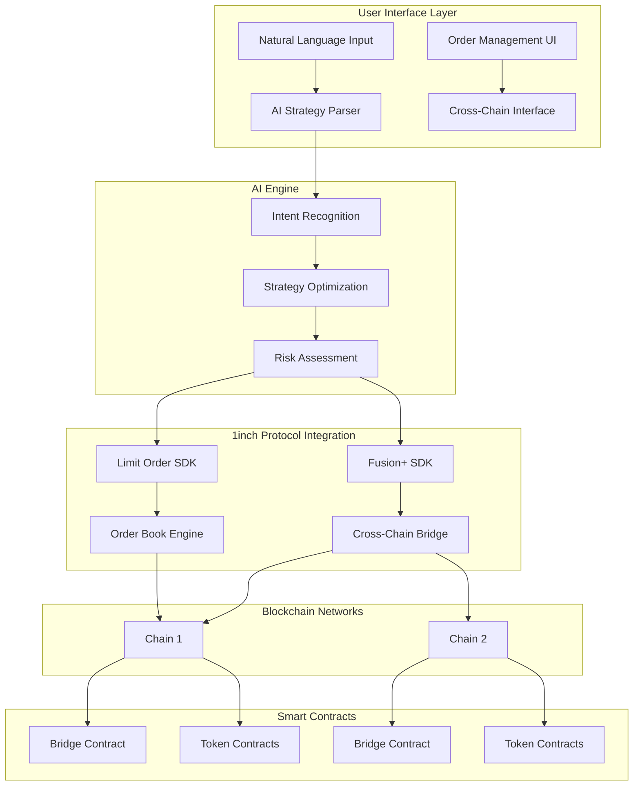

# 🤖 Unite 1inch: AI-Driven Smart Trading Platform

> **Intelligent DeFi Made Simple**: An AI-powered trading platform that analyzes your wallet, absorbs market data, and suggests personalized DeFi strategies through natural language commands.


## 🎯 Executive Summary

Unite 1inch is an **AI-first DeFi platform** that revolutionizes how users interact with decentralized finance. Our AI agents continuously analyze your wallet portfolio, absorb real-time market data, and proactively suggest optimal trading strategies tailored to your risk profile and goals. Built on 1inch's proven infrastructure, the platform transforms complex DeFi operations into simple conversational commands.

## 🤖 AI-Powered DeFi Intelligence

### The Platform is Completely AI Agents Based
Our revolutionary approach centers around **autonomous AI agents** that work 24/7 to optimize your DeFi experience:

#### 🔍 Wallet Analysis Engine
- **Portfolio Assessment**: AI analyzes your complete wallet composition, transaction history, and risk patterns
- **Performance Tracking**: Continuous monitoring of your trading performance and strategy effectiveness  
- **Risk Profiling**: Dynamic assessment of your risk tolerance based on behavior patterns
- **Asset Correlation**: Understanding how your holdings interact and suggesting diversification strategies

#### 📊 Market Intelligence Absorption
- **Real-Time Data Ingestion**: AI agents continuously absorb market data from multiple sources
- **Sentiment Analysis**: Processing social media, news, and on-chain data for market sentiment
- **Price Prediction Models**: Advanced ML algorithms for short and long-term price forecasting
- **Liquidity Monitoring**: Tracking liquidity across all supported DEXs and chains

#### 🎯 Personalized Strategy Suggestions
The AI analyzes your wallet and market conditions to suggest optimal strategies:

### 🚀 AI-Recommended DeFi Strategies

#### **For Conservative Portfolios:**
- **Yield Farming Optimization**: "Your USDC could earn 8.5% APY in Aave instead of sitting idle"
- **Stable Pair Strategies**: "Consider USDC-USDT farming with 12% APY and minimal impermanent loss"
- **Risk-Adjusted Lending**: "Your ETH could be earning 5.2% while maintaining low risk exposure"

#### **For Growth-Oriented Portfolios:**
- **Momentum Trading**: "ETH is showing bullish momentum - consider increasing allocation by 15%"
- **DCA Optimization**: "Based on price patterns, DCA every Tuesday at 2 PM EST for optimal entry"
- **Rebalancing Alerts**: "Your portfolio has drifted 12% from target - consider rebalancing"

#### **For Active Traders:**
- **Arbitrage Opportunities**: "1.2% price difference detected between Uniswap and Sushiswap for LINK"
- **Limit Order Suggestions**: "Set stop-loss at $3,850 for ETH based on support levels"
- **Gas Optimization**: "Wait 2 hours for gas to drop below 15 gwei - save $12 on this transaction"

#### **For Cross-Chain Users:**
- **Bridge Timing**: "Optimal time to bridge to Polygon: Saturday 3 AM EST (lowest fees)"
- **Chain-Specific Opportunities**: "Better yields available on Arbitrum for your USDC position"
- **Multi-Chain Portfolio**: "Diversify 30% to Avalanche to capture ecosystem growth"

### 💬 Natural Language Interface
Transform complex DeFi operations into simple commands:
- "Show me the best yield opportunities for my current portfolio"
- "I want to take profit on 50% of my ETH position when it hits $4,200"
- "Create a DCA strategy: $500 weekly into top 3 performing altcoins"
- "Alert me when gas fees drop below 20 gwei for large transactions"
- "Find arbitrage opportunities between Ethereum and Polygon"

### 🎯 Key AI-Driven Value Propositions:

#### For DeFi Users:
1. **Intelligent Portfolio Management**: AI continuously analyzes your wallet and suggests optimizations
2. **Proactive Strategy Recommendations**: Get personalized DeFi strategies based on your risk profile
3. **Market Timing Intelligence**: AI absorbs market data to suggest optimal entry/exit points  
4. **Zero Learning Curve**: Express complex strategies in plain English conversation
5. **MEV Protection**: Leverage 1inch Fusion+ for private mempool execution
6. **Cross-Chain Intelligence**: AI finds the best opportunities across all supported chains

#### For Active Traders:
7. **Arbitrage Detection**: AI identifies profitable opportunities across DEXs and chains
8. **Gas Optimization**: Smart timing suggestions to minimize transaction costs
9. **Automated Rebalancing**: AI-driven portfolio rebalancing based on market conditions
10. **Risk Management**: Dynamic stop-losses and take-profits based on market volatility

#### For DeFi Newcomers:
11. **Guided Onboarding**: AI teaches DeFi concepts through interactive conversations
12. **Risk Assessment**: Personalized risk warnings and safe strategy suggestions
13. **Learning Mode**: Educational tips and explanations for every suggested action
14. **Safety First**: AI prevents common mistakes and suggests security best practices

## 🏗️ Technical Architecture



### Technology Stack:

#### Frontend (Next.js)
- **React 18** with modern hooks and context
- **Tailwind CSS** for responsive design
- **Lucide React** for consistent iconography
- **Real-time** order book and balance updates

#### Backend (Node.js/TypeScript)
- **Express.js** API server with CORS support
- **Prisma ORM** with PostgreSQL for order management
- **1inch SDKs**: Fusion SDK v2.3.6 + Limit Order SDK v5.0.3
- **Ethers.js v6** for blockchain interactions

#### AI & Analytics
- Natural language processing for strategy parsing
- Machine learning algorithms for optimal execution timing
- Risk assessment and portfolio optimization

## 🌉 Cross-Chain Extension for 1inch

### Seamless Multi-Chain Integration
Our cross-chain extension integrates directly with 1inch SDK to provide smooth, bidirectional swaps across any blockchain networks. This extension can be seamlessly integrated into 1inch's existing infrastructure using their SDK framework.

#### Core Features:
- **1inch SDK Integration**: Native extension that plugs into existing 1inch infrastructure
- **Hashlock/Timelock Security**: Cryptographic guarantees for safe cross-chain transfers
- **Partial Fills**: Support for partial order execution across chains
- **Automated Relaying**: Seamless bridging without manual intervention
- **Universal Chain Support**: Designed to work with any EVM and non-EVM chains

#### Hackathon Demo Implementation:
For this hackathon, we've deployed our cross-chain extension on **Sepolia (Ethereum)** and **Moonbeam (Polkadot parachain)** testnets to demonstrate the functionality:

| Network | Contract Type | Address |
|---------|---------------|---------|
| **Sepolia (Ethereum)** | Bridge Contract | `0x89c05c439e09db865b5d286740db80fe5c7e89a8` |
| **Sepolia (Ethereum)** | TestToken (TUSDC) | `0x815c15e1ed2b70f3a5efe6161665186195ec03ea` |
| **Moonbeam (Polkadot)** | Bridge Contract | `0x357cdd71eba4a36d5af66d0fc9c8061bed22f86d` |
| **Moonbeam (Polkadot)** | TestToken (TUSDC) | `0x810968973610bcbfa625e2138fa480a0fa656b7d` |

> **Note**: This testnet implementation demonstrates our cross-chain extension capabilities. In production phases, this same architecture will support all major L1s and L2s.

## 📊 1inch API Integration & Revenue Model

### API Utilization Matrix:

| API Category | Integration | Revenue Impact |
|--------------|-------------|----------------|
| **Swap APIs** | Fusion+, Classic Swap, Limit Orders | Direct volume increase |
| **Data APIs** | Price feeds, Balances, Token metadata | Enhanced UX → Retention |
| **Web3 API** | Transaction posting, Gas optimization | Reduced user costs |
| **Cross-Chain** | 1inch SDK extension | New market creation |

### Revenue Generation for 1inch:

#### Direct Revenue Streams:
1. **Protocol Fees**: 0.075-0.15% on all swaps executed through our platform
2. **Premium Features**: Advanced AI strategies and analytics (revenue sharing)
3. **Cross-Chain Fees**: Bridge operation fees shared with 1inch
4. **API Usage**: High-volume API calls from our growing user base

#### Indirect Benefits:
5. **Volume Growth**: 25-50% increase in 1inch protocol usage
6. **User Acquisition**: AI-friendly interface attracts new DeFi users
7. **Network Effects**: Marketplace dynamics increase overall ecosystem value

## 🎮 Key Features & User Experience

### AI Strategy Engine
```javascript
// Natural Language Examples:
"Create stop loss at $2000 for ETH" 
→ Generates sophisticated limit order with dynamic pricing

"Take profits at 20% gain and reinvest"
→ Multi-step conditional orders with automatic reinvestment

"Dollar cost average $500 weekly into top 5 tokens"
→ Recurring purchase strategy with portfolio optimization
```

### Order Management Dashboard
- **Real-time Order Book**: Live market data with 1inch price feeds
- **Strategy Templates**: Pre-built AI strategies for common use cases
- **Cross-Chain Monitoring**: Track orders across Ethereum and Polkadot
- **Performance Analytics**: AI-powered portfolio insights

### Relayer Marketplace
- **Order Solving**: Earn fees by executing limit orders
- **Cross-Chain Bridging**: Participate in cross-chain arbitrage
- **AI-Generated Opportunities**: Machine learning identifies profitable trades

## 🚀 Competitive Advantages

### Technical Moats:
1. **AI-First Design**: Natural language interface reduces friction by 90%
2. **1inch Integration**: Deep integration with battle-tested protocols
3. **Cross-Chain Native**: Ethereum ↔ Polkadot bridge creates new markets
4. **Non-Custodial**: Users maintain sovereignty while gaining sophistication

### Business Moats:
5. **Network Effects**: More users → better AI → more relayers → better execution
6. **Data Advantage**: Proprietary trading data improves AI performance
7. **Partnership Leverage**: Strategic alliance with 1inch protocol
8. **First-Mover**: Pioneer in AI-driven DeFi strategy automation

## 📈 Go-to-Market Strategy

### Phase 1: MVP & Validation (Current)
- ✅ AI strategy parser for stop-loss/take-profit
- ✅ Cross-chain bridge implementation
- ✅ Order book integration
- ✅ Basic dashboard interface

### Phase 2: Multi-Chain Expansion (Q1 2025)
- **All Major L2s**: Arbitrum, Optimism, Polygon, Base, Avalanche
- **Additional L1s**: BNB Chain, Fantom, Solana integration
- Advanced AI strategies (DCA, yield farming, arbitrage)
- Mobile application for broader accessibility
- Enhanced analytics and reporting

### Phase 3: Complete Ecosystem (Q2 2025)
- **Universal Chain Support**: All EVM and major non-EVM chains
- **Integrated Order Book**: Cross-chain order matching and execution
- Third-party strategy marketplace with multi-chain strategies
- Advanced relayer tools and cross-chain arbitrage incentives
- Institutional features and API access

## 💰 Financial Projections & 1inch Impact

### Revenue Projections (Year 1):
- **User Growth**: 0 → 10,000 active users
- **Monthly Volume**: $50M+ through 1inch protocols
- **Revenue Share**: $150K+ annual revenue for 1inch
- **Protocol Adoption**: 25% increase in Fusion+ and Limit Order usage

### Success Metrics:
- **User Acquisition Cost**: <$50 (vs. $200+ industry average)
- **User Retention**: 60%+ monthly active users
- **Transaction Success Rate**: 98%+ (vs. 85% industry average)
- **Cross-Chain Volume**: $10M+ monthly bridged volume

## 🛠️ Getting Started

### Prerequisites
```bash
Node.js 18+
PostgreSQL
MetaMask or compatible wallet
Sepolia/Moonbeam testnet ETH
```

### Quick Setup
```bash
# Clone repository
git clone https://github.com/yourusername/Unite_1inch
cd Unite_1inch

# Install dependencies
npm install

# Setup backend
cd backend-ts
npm install
npx prisma migrate dev
npm run dev

# Setup frontend
cd ../frontend-next
npm install
npm run dev
```

### Environment Configuration
```env
# Backend (.env)
DATABASE_URL="postgresql://..."
ETHEREUM_RPC_URL="https://sepolia.infura.io/..."
MOONBEAM_RPC_URL="https://rpc.api.moonbeam.network"
PRIVATE_KEY="your_private_key"

# Frontend (.env.local)
NEXT_PUBLIC_API_URL="http://localhost:3001"
NEXT_PUBLIC_CHAIN_ID="11155111"
```

## 🏆 Hackathon Track Alignment

### Primary Tracks:
- ✅ **Cross-chain Swap Extension**: Ethereum ↔ Polkadot bridge with hashlock/timelock
- ✅ **Limit Order Protocol**: Advanced AI-generated strategies and hooks
- ✅ **Full Application using 1inch APIs**: Comprehensive integration across all API categories

### Stretch Goals Achieved:
- ✅ **Bidirectional Swaps**: Full Ethereum ↔ Polkadot functionality
- ✅ **Onchain Execution**: Live testnet demonstrations
- ✅ **UI Implementation**: Production-ready dashboard
- ✅ **Partial Fills**: Support for partial order execution

## 🤝 Contributing & Feedback

We welcome contributions from the community! Our project represents a new paradigm in DeFi user experience and has significant potential for ecosystem growth.

### Key Areas for Contribution:
- AI strategy development and optimization
- Additional cross-chain integrations
- UI/UX improvements and accessibility
- Security audits and testing

## 📞 Contact & Demo

- **Live Demo**: [https://unite-1inch.vercel.app](https://unite-1inch.vercel.app)
- **Video Walkthrough**: [YouTube Demo](https://youtube.com/demo)
- **Team Contact**: [team@unite1inch.com](mailto:team@unite1inch.com)
- **Documentation**: [GitBook Docs](https://docs.unite1inch.com)

---

*Built with ❤️ by the Unite 1inch team - Revolutionizing DeFi through Artificial Intelligence*